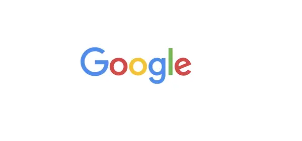

---
layout: homepage
title: Research Lab | Sayanton Dibbo
---

  <a href="index.html">Home</a>
  <a href="research.html">Research</a>
  <a href="teaching.html">Teaching</a>
  <a href="grants.html" class="active">Grants</a>

## Our Research Lab Members

    
    

## Our Research Lab Supporters

    
    

